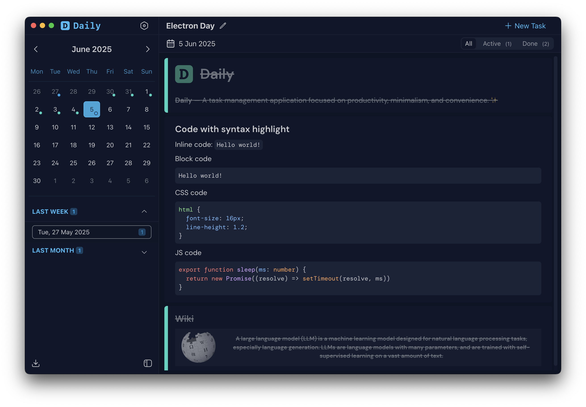
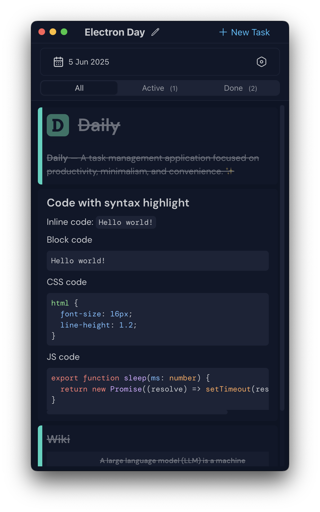

#  Daily 

**Daily** — A task management application focused on productivity, minimalism, and convenience. ✨

| Desktop Version                    | Mobile Version                           |
| ---------------------------------- | ---------------------------------------- |
|  |  |

### This project is a web version of [Daily App](https://github.com/scheron/Daily).


## [Open Web version](https://scheron.github.io/DailyWeb/)

## Concept 💡
The whole approach originated from my need to transform my daily task tracking into something more systematic. 

I typically maintain my tasks organized by days, which allows me to revisit and track progress later. 

This stems from the standard workflow requirement: *"What I did yesterday, what I'm doing today"* 📊

```md
## Monday, Dec 16

- [x] Review pull requests  
- [x] Team standup meeting
- [ ] Complete feature implementation

## Tuesday, Dec 17

- [x] Deploy to staging
- [ ] Write documentation
- [ ] Plan next sprint

...
```

## Data Storage 💾

Data is stored locally in IndexedDB storage.
